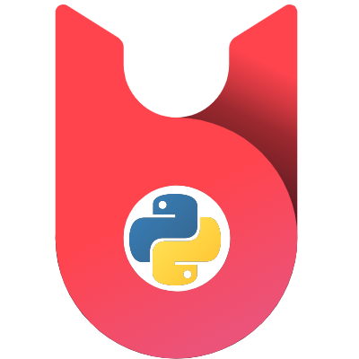

# Bobsled Python SDK
> A Python library to interact with Bobsled



## Installation

```sh
pip install bobsled-python-sdk
```

## Getting Started
```python
from bobsled_sdk import BobsledClient

credentials = { "email": "ex@mple.com", "password": "example"}

b = BobsledClient(credentials)
```

## Development setup

```sh
pip install -r requirements.txt
pytest tests
```

## Release History

* 1.0.0
    * Initial release

## Meta

Danny Yu – danny@berkeley.edu

Distributed under the MIT License. See ``LICENSE`` for more information.

[https://github.com/danny-yu](https://github.com/danny-yu)

## Contributing

1. Fork it (<https://github.com/yourname/yourproject/fork>)
2. Create your feature branch (`git checkout -b feature/fooBar`)
3. Commit your changes (`git commit -am 'Add some fooBar'`)
4. Push to the branch (`git push origin feature/fooBar`)
5. Create a new Pull Request
